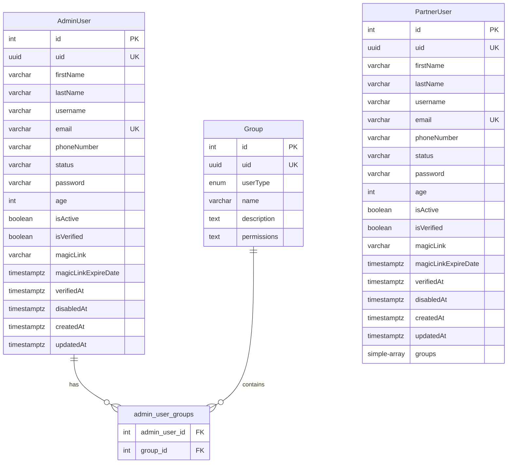

# IAM Service (Identity and Access Management)

**Package**: `@mangojs/iam-service`
**Version**: 0.1.0
**Port**: 3001
**Framework**: MangoJS

## Overview

The IAM Service provides comprehensive Identity and Access Management capabilities for the MangoJS microservices ecosystem. It handles authentication, authorization, user management, roles, and permissions using a robust Role-Based Access Control (RBAC) system.

### Features

- **Multi-tenancy Authentication**: Separate authentication flows for Admin and Partner users
- **JWT-based Security**: Secure cookie-based JWT tokens with configurable expiration
- **Role-Based Access Control (RBAC)**: Group-based permissions system
- **User Management**: Complete CRUD operations with activation workflows
- **Magic Links**: Passwordless authentication support
- **Account Management**: Enable/disable accounts, soft/hard delete
- **Database Agnostic**: Supports CockroachDB and PostgreSQL via TypeORM

## Data Model



## API Endpoints

### Health Check

| Method | Endpoint             | Description          | Auth Required |
| ------ | -------------------- | -------------------- | ------------- |
| GET    | `/api/iam/v1/health` | Service health check | No            |

### Authentication - Admin

| Method | Endpoint                           | Description             | Auth Required |
| ------ | ---------------------------------- | ----------------------- | ------------- |
| POST   | `/api/iam/v1/auth/admins/login`    | Admin user login        | No            |
| POST   | `/api/iam/v1/auth/admins/logout`   | Admin user logout       | Yes           |
| POST   | `/api/iam/v1/auth/admins/register` | Register new admin user | No            |
| POST   | `/api/iam/v1/auth/admins/verify`   | Verify admin JWT token  | Yes           |

**Login Request Example:**

```json
{
  "email": "admin@example.com",
  "password": "hashedPassword123"
}
```

**Login Response Example:**

```json
{
  "ok": true,
  "timestamp": "2024-10-14T12:00:00Z",
  "requestId": "req-123",
  "data": {
    "authenticated": true,
    "message": "Authentication Successful.",
    "user": {
      "uid": "uuid-string",
      "firstName": "John",
      "lastName": "Doe",
      "email": "admin@example.com"
    }
  }
}
```

### Authentication - Partner

| Method | Endpoint                             | Description               | Auth Required |
| ------ | ------------------------------------ | ------------------------- | ------------- |
| POST   | `/api/iam/v1/auth/partners/login`    | Partner user login        | No            |
| POST   | `/api/iam/v1/auth/partners/logout`   | Partner user logout       | Yes           |
| POST   | `/api/iam/v1/auth/partners/register` | Register new partner user | No            |
| POST   | `/api/iam/v1/auth/partners/verify`   | Verify partner JWT token  | Yes           |

### Admin User Management

| Method | Endpoint                                   | Description             | Auth Required |
| ------ | ------------------------------------------ | ----------------------- | ------------- |
| GET    | `/api/iam/v1/admins`                       | List all admin users    | Yes           |
| POST   | `/api/iam/v1/admins`                       | Create new admin user   | Yes           |
| PUT    | `/api/iam/v1/admins/:uid`                  | Update admin user       | Yes           |
| PUT    | `/api/iam/v1/admins/:uid/groups`           | Update user groups      | Yes           |
| GET    | `/api/iam/v1/admins/magiclinks/:magiclink` | Get admin by magic link | No            |
| POST   | `/api/iam/v1/admins/activate/:magiclink`   | Activate admin account  | No            |
| POST   | `/api/iam/v1/admins/:uid/enable`           | Enable admin account    | Yes           |
| POST   | `/api/iam/v1/admins/:uid/disable`          | Disable admin account   | Yes           |
| DELETE | `/api/iam/v1/admins/:uid/delete/hard`      | Hard delete admin user  | Yes           |

### Partner User Management

| Method | Endpoint                    | Description             | Auth Required |
| ------ | --------------------------- | ----------------------- | ------------- |
| GET    | `/api/iam/v1/partners`      | List all partner users  | Yes           |
| POST   | `/api/iam/v1/partners`      | Create new partner user | Yes           |
| GET    | `/api/iam/v1/partners/:uid` | Get partner user by UID | Yes           |
| PUT    | `/api/iam/v1/partners/:uid` | Update partner user     | Yes           |
| DELETE | `/api/iam/v1/partners/:uid` | Delete partner user     | Yes           |

### Group Management

| Method | Endpoint                     | Description          | Auth Required |
| ------ | ---------------------------- | -------------------- | ------------- |
| GET    | `/api/iam/v1/groups`         | List all groups      | Yes           |
| POST   | `/api/iam/v1/groups`         | Create new group     | Yes           |
| GET    | `/api/iam/v1/groups/admin`   | List admin groups    | Yes           |
| POST   | `/api/iam/v1/groups/admin`   | Create admin group   | Yes           |
| GET    | `/api/iam/v1/groups/partner` | List partner groups  | Yes           |
| POST   | `/api/iam/v1/groups/partner` | Create partner group | Yes           |
| DELETE | `/api/iam/v1/groups/:uid`    | Delete group         | Yes           |

## Setup Instructions

### Prerequisites

- Node.js 18+ and pnpm
- CockroachDB or PostgreSQL database
- MangoJS core library

### Installation

1. **Install dependencies from the monorepo root:**

   ```bash
   pnpm install
   ```

2. **Create environment file:**

   ```bash
   cp services/iam-service/.env.example services/iam-service/.env
   ```

3. **Configure environment variables in `.env`:**

   ```env
   # Database Configuration
   DATABASE_URL=postgresql://[USER]:[PASSWORD]@[HOST]:[PORT]/[DATABASE]

   # JWT Secrets (change in production!)
   ADMIN_COOKIE_KEY_FIRST=your-secure-admin-secret-1
   ADMIN_COOKIE_KEY_SECOND=your-secure-admin-secret-2
   PARTNER_COOKIE_KEY_FIRST=your-secure-partner-secret-1
   PARTNER_COOKIE_KEY_SECOND=your-secure-partner-secret-2

   # Other configurations...
   ```

4. **Copy source files from demo service:**

   ```bash
   # Run the existing copy script
   bash copy_iam.sh
   ```

   This copies:

   - All route controllers
   - Service layer implementations
   - Database models (entities)
   - Type definitions

5. **Build the service:**
   ```bash
   pnpm --filter @mangojs/iam-service build
   ```

## Running the Service

### Development Mode

Run with hot reload:

```bash
pnpm --filter @mangojs/iam-service dev
```

Or from the service directory:

```bash
cd services/iam-service
pnpm dev
```

### Production Mode

```bash
pnpm --filter @mangojs/iam-service build
pnpm --filter @mangojs/iam-service start
```

### With Debugging

```bash
pnpm --filter @mangojs/iam-service start:dev
```

The service will be available at: `http://localhost:3001`

Swagger documentation: `http://localhost:3001/api-docs`

## Development

### Project Structure

```
services/iam-service/
├── src/
│   ├── db/
│   │   └── models/          # TypeORM entities
│   │       ├── AdminUser.entity.ts
│   │       ├── PartnerUser.entity.ts
│   │       └── Group.entity.ts
│   ├── routes/              # API route controllers
│   │   ├── health/
│   │   └── v1/
│   │       ├── auth/        # Authentication controllers
│   │       ├── admins/      # Admin management
│   │       ├── partners/    # Partner management
│   │       └── groups/      # Group management
│   ├── services/            # Business logic layer
│   │   ├── adminUser.service.ts
│   │   ├── partnerUser.service.ts
│   │   ├── authorizationService.ts
│   │   └── group.service.ts
│   ├── types/               # TypeScript type definitions
│   ├── index.ts             # Application entry point
│   ├── inversify.config.ts  # Dependency injection config
│   └── inversify.types.ts   # DI type symbols
├── .env.example             # Environment template
├── package.json
├── tsconfig.json
├── swagger.json
└── README.md
```

### Running Tests

```bash
pnpm --filter @mangojs/iam-service test
```

Watch mode:

```bash
pnpm --filter @mangojs/iam-service test:watch
```

## Authentication Flow

### Admin Login Flow

1. User submits credentials (`POST /api/iam/v1/auth/admins/login`)
2. System validates email and password
3. JWT token is generated with admin claims
4. Secure HTTP-only cookie is set with the token
5. User information is returned in response

### Token Verification

1. Client sends request with cookie
2. Middleware extracts and verifies JWT token
3. User claims are validated
4. Request continues with authenticated user context

### Logout Flow

1. User calls logout endpoint
2. Cookie is cleared (set to null)
3. Client-side token should be removed

## Authorization (RBAC)

### Group-Based Permissions

The service uses a group-based permission model:

- **Groups** contain sets of permissions
- **Admin Users** can belong to multiple groups via many-to-many relationship
- **Partner Users** have groups stored as simple array
- **Permissions** are stored as strings and checked via decorators

### Using Authorization Decorators

```typescript
@Get('/protected')
@IsAuthorized()
@HasGroups(['Admin', 'Manager'])
public async protectedRoute(req: Request, res: Response) {
    // Only authenticated users in Admin or Manager groups can access
}
```

## Security Considerations

### Best Practices

1. **Environment Variables**: Never commit `.env` files with actual secrets
2. **JWT Secrets**: Use strong, random secrets in production
3. **Cookie Configuration**:
   - Always use `secure: true` in production (HTTPS)
   - Set appropriate `sameSite` based on your frontend architecture
4. **Password Hashing**: Passwords are hashed with bcrypt (configure `BCRYPT_ROUNDS`)
5. **Rate Limiting**: Implement rate limiting for login endpoints
6. **CORS**: Configure `ALLOWED_ORIGINS` to whitelist your frontend domains
7. **Database**: Use SSL connections in production

### Security Headers

The service uses Helmet.js for security headers:

- X-Frame-Options
- X-Content-Type-Options
- Strict-Transport-Security (in production)

## Troubleshooting

### Common Issues

**Database Connection Fails**

- Verify `DATABASE_URL` is correct
- Check database is running and accessible
- Ensure database user has appropriate permissions

**Authentication Not Working**

- Check JWT secrets are set in `.env`
- Verify cookie settings (domain, secure, sameSite)
- Check CORS configuration

**TypeScript Build Errors**

- Run `pnpm install` to ensure dependencies are installed
- Check `tsconfig.json` extends root configuration
- Verify `@giusmento/mangojs-core` is properly linked

## Integration with Monorepo

The service is designed to work within a pnpm monorepo:

- Build all services: `pnpm build`
- Run all services: `pnpm dev`
- Test all services: `pnpm test`
- Run this service only: `pnpm --filter @mangojs/iam-service <command>`

## Contributing

When adding new features:

1. Add routes in `src/routes/`
2. Implement business logic in `src/services/`
3. Define types in `src/types/`
4. Update Swagger documentation
5. Add tests
6. Update this README if adding new endpoints

## License

ISC
