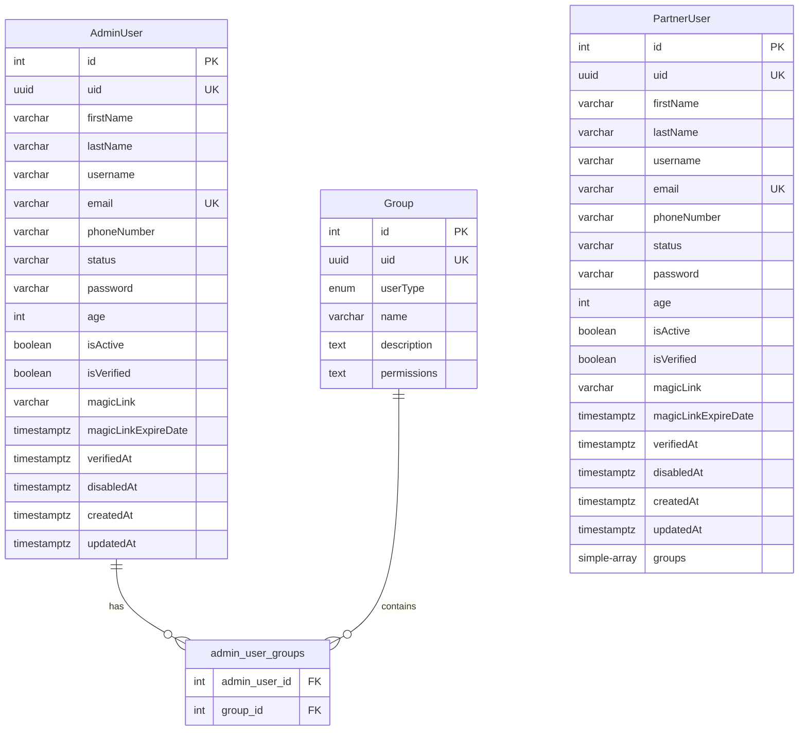

# IAM Service (Identity and Access Management)

**Package**: `@mangojs/iam-service`
**Version**: 0.1.0
**Port**: 3001
**Framework**: MangoJS

## 1. Overview

The IAM Service provides comprehensive Identity and Access Management capabilities for the MangoJS microservices ecosystem. Built with TypeORM and Express, this service handles authentication, authorization, user management, and role-based access control (RBAC) for multiple user types.

### Key Features

- **Multi-tenancy Authentication**: Separate authentication flows for Admin and Partner users
- **JWT-based Security**: Secure HTTP-only cookie-based JWT tokens with configurable expiration
- **Role-Based Access Control (RBAC)**: Group-based permissions system with flexible authorization
- **User Lifecycle Management**: Complete CRUD operations with activation workflows
- **Magic Link Support**: Passwordless authentication option
- **Account Management**: Enable/disable accounts, soft/hard delete capabilities
- **Database Migrations**: TypeORM migrations for schema management and data seeding
- **Database Support**: Compatible with CockroachDB and PostgreSQL

## 2. Service Description

### Architecture

The IAM Service follows a layered architecture pattern:

- **Routes Layer**: RESTful API endpoints using Express.js
- **Service Layer**: Business logic and data processing
- **Repository Layer**: TypeORM entities and data access
- **Middleware Layer**: Authentication, authorization, and request validation

### Data Model



### User Types

- **Admin Users**: Full system administrators with group-based permissions via many-to-many relationships
- **Partner Users**: External partners with configurable group permissions stored as arrays
- **Groups**: Permission containers that define access levels and capabilities

### Security Features

- Password hashing using bcrypt (configurable rounds)
- HTTP-only secure cookies for JWT storage
- CORS protection with configurable allowed origins
- Helmet.js security headers
- SSL/TLS database connections
- Magic link token expiration
- Account lockout mechanisms

## 3. Default User

A default admin user is automatically seeded during database migration for initial system access.

### Default Credentials

- **Email**: `admin@pulkerbook.com`
- **Password**: `admin123`
- **Status**: ACTIVE
- **Verified**: Yes
- **UID**: `a0000000-0000-0000-0000-000000000001`

### Migration Details

The seed migration file: [1760518589000-SeedAdminUser.ts](migrations/1760518589000-SeedAdminUser.ts)

To run migrations:

```bash
cd services/iam-service
pnpm migration:run
```

To view migration status:

```bash
pnpm migration:show
```

**⚠️ Security Notice**: Change the default password immediately after first login in production environments.

## 4. Endpoints

### Health Check

| Method | Endpoint             | Description          | Auth Required |
| ------ | -------------------- | -------------------- | ------------- |
| GET    | `/api/iam/v1/health` | Service health check | No            |

### Authentication - Admin

| Method | Endpoint                           | Description             | Auth Required |
| ------ | ---------------------------------- | ----------------------- | ------------- |
| POST   | `/api/iam/v1/auth/admins/login`    | Admin user login        | No            |
| POST   | `/api/iam/v1/auth/admins/logout`   | Admin user logout       | Yes           |
| POST   | `/api/iam/v1/auth/admins/register` | Register new admin user | No            |
| POST   | `/api/iam/v1/auth/admins/verify`   | Verify admin JWT token  | Yes           |

### Authentication - Partner

| Method | Endpoint                             | Description               | Auth Required |
| ------ | ------------------------------------ | ------------------------- | ------------- |
| POST   | `/api/iam/v1/auth/partners/login`    | Partner user login        | No            |
| POST   | `/api/iam/v1/auth/partners/logout`   | Partner user logout       | Yes           |
| POST   | `/api/iam/v1/auth/partners/register` | Register new partner user | No            |
| POST   | `/api/iam/v1/auth/partners/verify`   | Verify partner JWT token  | Yes           |

### Admin User Management

| Method | Endpoint                                   | Description             | Auth Required |
| ------ | ------------------------------------------ | ----------------------- | ------------- |
| GET    | `/api/iam/v1/admins`                       | List all admin users    | Yes           |
| POST   | `/api/iam/v1/admins`                       | Create new admin user   | Yes           |
| PUT    | `/api/iam/v1/admins/:uid`                  | Update admin user       | Yes           |
| PUT    | `/api/iam/v1/admins/:uid/groups`           | Update user groups      | Yes           |
| GET    | `/api/iam/v1/admins/magiclinks/:magiclink` | Get admin by magic link | No            |
| POST   | `/api/iam/v1/admins/activate/:magiclink`   | Activate admin account  | No            |
| POST   | `/api/iam/v1/admins/:uid/enable`           | Enable admin account    | Yes           |
| POST   | `/api/iam/v1/admins/:uid/disable`          | Disable admin account   | Yes           |
| DELETE | `/api/iam/v1/admins/:uid/delete/hard`      | Hard delete admin user  | Yes           |

### Partner User Management

| Method | Endpoint                    | Description             | Auth Required |
| ------ | --------------------------- | ----------------------- | ------------- |
| GET    | `/api/iam/v1/partners`      | List all partner users  | Yes           |
| POST   | `/api/iam/v1/partners`      | Create new partner user | Yes           |
| GET    | `/api/iam/v1/partners/:uid` | Get partner user by UID | Yes           |
| PUT    | `/api/iam/v1/partners/:uid` | Update partner user     | Yes           |
| DELETE | `/api/iam/v1/partners/:uid` | Delete partner user     | Yes           |

### Group Management

| Method | Endpoint                     | Description          | Auth Required |
| ------ | ---------------------------- | -------------------- | ------------- |
| GET    | `/api/iam/v1/groups`         | List all groups      | Yes           |
| POST   | `/api/iam/v1/groups`         | Create new group     | Yes           |
| GET    | `/api/iam/v1/groups/admin`   | List admin groups    | Yes           |
| POST   | `/api/iam/v1/groups/admin`   | Create admin group   | Yes           |
| GET    | `/api/iam/v1/groups/partner` | List partner groups  | Yes           |
| POST   | `/api/iam/v1/groups/partner` | Create partner group | Yes           |
| DELETE | `/api/iam/v1/groups/:uid`    | Delete group         | Yes           |

### API Documentation

Interactive Swagger documentation is available at: `http://localhost:3001/api-docs`

## 5. Database Connection

### Configuration

The service uses TypeORM with PostgreSQL. Database configuration is managed through environment variables and the [data-source.ts](data-source.ts) file.

### Environment Variables

Required database environment variables in `.env`:

```env
# Database Configuration
DATABASE_URL=postgresql://[DATABASE_USER]:[DATABASE_PASSWORD]@[DATABASE_HOST]:[DATABASE_PORT]/[DATABASE_NAME]
DATABASE_HOST=localhost
DATABASE_PORT=26257
DATABASE_NAME=iam_db
DATABASE_USER=your_db_user
DATABASE_PASSWORD=your_db_password
```

### Database Migrations

The service uses TypeORM migrations for schema management:

**View migration status:**

```bash
cd services/iam-service
pnpm migration:show
```

**Run pending migrations:**

```bash
pnpm migration:run
```

**Revert last migration:**

```bash
pnpm migration:revert
```

### Existing Migrations

1. **InitialSchema** ([1760518588684-InitialSchema.ts](migrations/1760518588684-InitialSchema.ts))

   - Creates `admin_users` table
   - Creates `partner_users` table
   - Creates `groups` table with user type enum
   - Creates `admin_user_groups` junction table
   - Sets up foreign key relationships

2. **SeedAdminUser** ([1760518589000-SeedAdminUser.ts](migrations/1760518589000-SeedAdminUser.ts))
   - Seeds default admin user
   - Hashes password using bcrypt
   - Includes rollback capability

### Database Schema

The service uses the `iam` schema in PostgreSQL with the following tables:

- `iam.admin_users` - Administrator user accounts
- `iam.partner_users` - Partner user accounts
- `iam.groups` - Permission groups
- `iam.admin_user_groups` - Many-to-many relationship between admins and groups

## Setup Instructions

### Prerequisites

- Node.js 18+ and pnpm
- PostgreSQL or CockroachDB database
- MangoJS core library

### Installation

1. **Install dependencies from monorepo root:**

   ```bash
   pnpm install
   ```

2. **Create environment file:**

   ```bash
   cp services/iam-service/.env.example services/iam-service/.env
   ```

3. **Configure environment variables:**
   Edit `services/iam-service/.env` with your database credentials and JWT secrets.

4. **Run database migrations:**

   ```bash
   cd services/iam-service
   pnpm migration:run
   ```

5. **Build the service:**
   ```bash
   pnpm build
   ```

### Running the Service

**Development mode with hot reload:**

```bash
cd services/iam-service
pnpm dev
```

**Production mode:**

```bash
pnpm build
pnpm start
```

The service will be available at: `http://localhost:3001`

## Project Structure

```
services/iam-service/
├── src/
│   ├── db/
│   │   └── models/              # TypeORM entities
│   │       ├── AdminUser.entity.ts
│   │       ├── PartnerUser.entity.ts
│   │       └── Group.entity.ts
│   ├── routes/                  # API route controllers
│   │   ├── health/
│   │   └── v1/
│   │       ├── auth/            # Authentication
│   │       ├── admins/          # Admin management
│   │       ├── partners/        # Partner management
│   │       └── groups/          # Group management
│   ├── services/                # Business logic
│   │   ├── adminUser.service.ts
│   │   ├── partnerUser.service.ts
│   │   ├── authorizationService.ts
│   │   └── group.service.ts
│   ├── types/                   # TypeScript types
│   ├── index.ts                 # Entry point
│   ├── inversify.config.ts      # DI configuration
│   └── inversify.types.ts       # DI symbols
├── migrations/                  # Database migrations
│   ├── 1760518588684-InitialSchema.ts
│   └── 1760518589000-SeedAdminUser.ts
├── data-source.ts               # TypeORM config
├── .env.example
├── package.json
├── tsconfig.json
└── README.md
```

## Authentication Flow

### Login Flow

1. User submits credentials to login endpoint
2. System validates email and password (bcrypt comparison)
3. JWT token is generated with user claims
4. Secure HTTP-only cookie is set with the token
5. User information returned in response

### Token Verification

1. Client sends request with cookie
2. Middleware extracts and verifies JWT token
3. User claims validated
4. Request continues with authenticated context

### Logout Flow

1. User calls logout endpoint
2. Cookie is cleared (set to null)
3. Client-side session terminated

## Authorization (RBAC)

### Group-Based Permissions

- **Groups** contain sets of permissions
- **Admin Users** can belong to multiple groups (many-to-many)
- **Partner Users** have groups stored as arrays
- **Permissions** checked via decorators and middleware

### Using Authorization

```typescript
@Get('/protected')
@IsAuthorized()
@HasGroups(['Admin', 'Manager'])
public async protectedRoute(req: Request, res: Response) {
    // Only authenticated users in Admin or Manager groups can access
}
```

## Security Best Practices

1. **Change default credentials** immediately after first deployment
2. **Use strong JWT secrets** - Generate random strings for production
3. **Enable HTTPS** - Set `ADMIN_COOKIE_SECURE=true` in production
4. **Configure CORS** - Whitelist only trusted origins in `ALLOWED_ORIGINS`
5. **Use SSL for database** - Enable SSL connections in production
6. **Rotate secrets regularly** - Update JWT secrets periodically
7. **Implement rate limiting** - Protect login endpoints from brute force
8. **Monitor failed login attempts** - Track and alert on suspicious activity

## License

ISC
