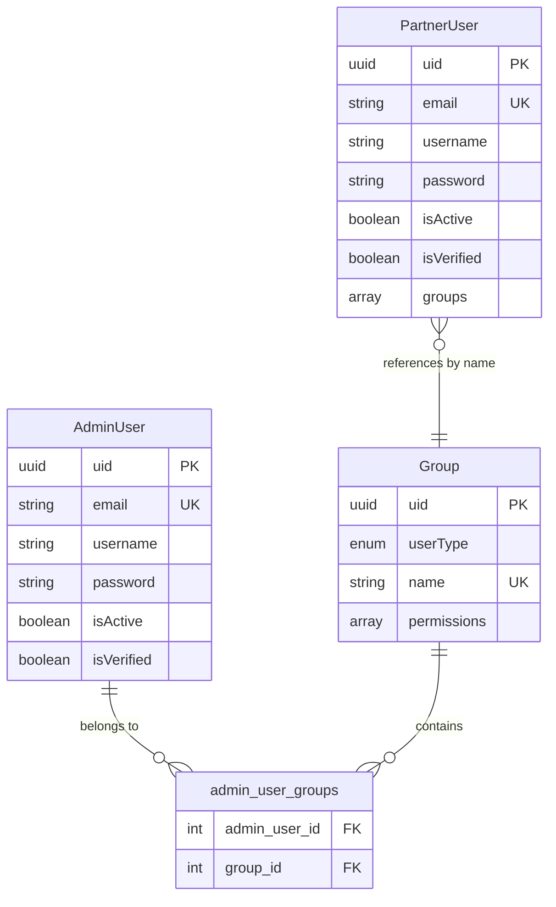

# Conceptual Data Model - IAM Service

This document describes the conceptual data model for the IAM (Identity and Access Management) Service.

## Entities

### AdminUser

**Purpose**: Represents administrative users with full system access

**Business Rules**:
- Must have unique email address
- Must have unique UID (UUID)
- Can belong to multiple groups (many-to-many)
- Account can be activated via magic link
- Account can be enabled/disabled by administrators
- Passwords are hashed using bcrypt
- JWT tokens issued for authentication
- Magic links expire after configured time period

**Lifecycle States**:
1. Created (inactive, unverified)
2. Activation link sent
3. Activated (verified)
4. Active/Enabled (can log in)
5. Disabled (cannot log in)
6. Hard deleted (permanently removed)

### PartnerUser

**Purpose**: Represents partner/customer users with limited system access

**Business Rules**:
- Must have unique email address
- Must have unique UID (UUID)
- Groups stored as simple array (not many-to-many)
- Account can be activated via magic link
- Can self-register
- Passwords are hashed using bcrypt
- JWT tokens issued for authentication
- Magic links expire after configured time period

**Lifecycle States**:
1. Registered (inactive, unverified)
2. Activation link sent
3. Activated (verified)
4. Active (can log in)
5. Disabled (cannot log in)
6. Deleted (soft or hard delete)

### Group

**Purpose**: Container for permissions and authorization rules

**Business Rules**:
- Has unique name per user type (ADMIN or PARTNER)
- Contains array of permission strings
- Can be assigned to multiple users
- User type determines if group applies to admins or partners
- Permissions are checked using decorators (`@HasGroups`)

**Permission Examples**:
- `users.create`
- `users.read`
- `users.update`
- `users.delete`
- `partners.manage`
- `reports.view`

## Relationships

### AdminUser ↔ Group (Many-to-Many)

- **Relationship**: `admin_user_groups` junction table
- **Cardinality**: Admin user can have multiple groups, group can have multiple admin users
- **Business Meaning**: Admin users inherit all permissions from all their groups
- **Cascade**: Deleting admin user removes group associations; deleting group removes user associations

### PartnerUser → Group (Simple Array)

- **Relationship**: Group names stored as array in `groups` column
- **Cardinality**: Partner user can reference multiple groups
- **Business Meaning**: Partner users inherit permissions from referenced groups
- **Note**: No foreign key constraint; groups stored as strings

## Entity Relationship Diagram



## Authentication Flow

### Login

1. User submits email and password
2. System looks up user by email
3. Password hash is verified
4. If valid:
   - JWT token generated with user claims
   - Token stored in secure HTTP-only cookie
   - User data returned to client
5. If invalid:
   - Authentication failure response

### Token Verification

1. Request includes JWT cookie
2. Middleware extracts and validates token
3. User claims decoded
4. Groups/permissions retrieved
5. Request proceeds with authenticated context

### Magic Link Activation

1. New user created with `isActive: false`, `isVerified: false`
2. Magic link generated and stored
3. Expiration date set
4. Link sent to user's email
5. User clicks link
6. System validates magic link and expiration
7. User activates account (sets password)
8. User marked as active and verified

## Authorization Model (RBAC)

### Permission Inheritance

**Admin Users**:
```
AdminUser → admin_user_groups → Group → permissions[]
```

**Partner Users**:
```
PartnerUser → groups[] → Group lookup → permissions[]
```

### Permission Check Example

```typescript
// Controller decorator
@HasGroups(['Admin', 'Manager'])
public async adminOperation() {
  // Only users in Admin OR Manager groups can access
}
```

## Data Integrity Rules

### Unique Constraints

- `email` must be unique across all admin users
- `email` must be unique across all partner users
- `uid` must be unique across all admin users
- `uid` must be unique across all partner users
- `name` must be unique per `userType` in groups

### Required Fields

**AdminUser/PartnerUser**:
- `firstName`, `lastName`, `email`, `password` (on creation)

**Group**:
- `userType`, `name`

### Default Values

- `isActive`: `true`
- `isVerified`: `false`
- `status`: `ACTIVE`
- `createdAt`: Current timestamp
- `updatedAt`: Current timestamp

## Soft Delete vs Hard Delete

### AdminUser

- **Soft Delete**: Set `isActive: false`, `disabledAt: timestamp`
- **Hard Delete**: `DELETE FROM admin_users WHERE uid = ?`

### PartnerUser

- **Soft Delete**: Set `isActive: false`
- **Hard Delete**: `DELETE FROM partner_users WHERE uid = ?`

### Group

- **Hard Delete Only**: `DELETE FROM groups WHERE uid = ?`
- **Cascade**: Removes all `admin_user_groups` associations

## Security Considerations

1. **Passwords**: Never stored in plain text; always hashed with bcrypt
2. **Magic Links**: Single-use, time-limited tokens
3. **JWT Tokens**: Signed with secret keys, stored in HTTP-only cookies
4. **User Enumeration**: Login failures don't reveal if email exists
5. **Rate Limiting**: Should be implemented on authentication endpoints
