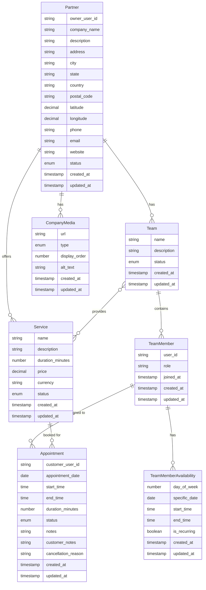

# Conceptual Data Model - Partner Service

This document describes the conceptual data model for the Partner Service, showing the main entities and their relationships.

## Entity Descriptions

### Partner (Company)
Represents a business/company that registers on the platform. Partners own teams, offer services, and manage their company media.

### Team
A group within a partner company. Teams are assigned to provide specific services.

### TeamMember
Individual users (from IAM service) who belong to teams. Appointments are assigned to specific team members.

### Service
Services offered by partners. Services have pricing, duration, and can be provided by multiple teams.

### CompanyMedia
Media assets (logo, cover images, gallery) for partners.

### Appointment
Customer bookings for services with specific team members.

### TeamMemberAvailability
Defines when team members are available for appointments. Supports both recurring weekly patterns and one-time date-specific availability.

## Key Relationships

1. **Partner → Teams**: One partner can have multiple teams (1:N)
2. **Partner → Services**: One partner can offer multiple services (1:N)
3. **Team → TeamMembers**: One team can have multiple members (1:N)
4. **Team ↔ Services**: Many-to-many relationship (teams can provide multiple services, services can be provided by multiple teams)
5. **TeamMember → Appointments**: One team member can have multiple appointments (1:N)
6. **Service → Appointments**: One service can have multiple appointments (1:N)
7. **TeamMember → Availability**: One team member can have multiple availability rules (1:N)
